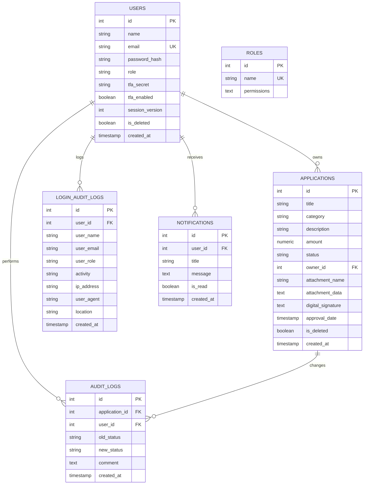

# SmartFlow — Submission & Approval Workflow Application (Open Ownership Branded Edition)

This project is a multi-tier web application implementing an **Application Submission & Approval Workflow**. It has been customized to align with **Open Ownership's brand identity** (featuring official SVG logos and their signature `#3b25d8` vibrant blue-indigo and `#312783` deep navy-indigo color scheme).

It features a **Go backend** (powered by `go-chi` and PostgreSQL), a modern **Vite React SPA frontend** (styled with Tailwind CSS v4 and glassmorphism), and is fully containerized using **Docker** and **Docker Compose**.

---

## Hosted / Deployed URL

The project is deployed and live at:

* **Live Portal URL**: <https://smartflow-frontend-djlc.onrender.com>

---

## Features & Requirements Met

1. **Authentication & Roles**:
   * Applicant (`applicant@test.com` / `password123`)
   * Reviewer (`reviewer@test.com` / `password123`)
   * Secure login, session persistence, role verification, and JWT token protection.
   * **Strict Single-Device Concurrency Lock**: Tracks active session version in the database. Logging into a new browser automatically drops the active session of any previously logged-in browsers for the same user.
2. **Two-Factor Authentication (2FA/TOTP) & Dev Assistant**:
   * **Zero-Dependency Security**: RFC 6238 compliant Time-based One-Time Passwords (TOTP) implemented in pure Go (using standard library `crypto/hmac`, `crypto/sha1`, `encoding/base32` packages).
   * **Web-Based Setup & Validation**: Setup modal in user settings displays a dynamic QR code and secret key alongside a **dynamic auto-updating token timer** and an **Auto-fill** button using standard Javascript Web Crypto API.
   * **Dev Login Verification Helper**: Intercepts logins for 2FA-enabled accounts, displaying a secure developer assistant banner on the MFA screen that fetches the active code (via `/api/2fa/dev-code`) and provides a single-click **Auto-fill** option for local testing.
3. **Brand Identity & Dynamic Theming**:
   * Integrates the official Open Ownership logo (comprising the corporate beneficial ownership circles emblem and wordmark) in the portal.
   * Features a **Dynamic Color Picker** located in the profile dropdown menu, allowing users to customize their entire portal aesthetic globally by selecting from a range of themes (Indigo, Emerald, Rose, Slate).
   * Leverages Tailwind v4's dynamic CSS variables to seamlessly inject themes without reloading, with preferences preserved across sessions.
4. **Interactive Dashboard Analytics (SVG)**:
   * **Category Funding Donut Chart**: Shows responsive category funding distributions, dynamic center text displaying value/percentages on segment hover, and synced interactive legend cards.
   * **Status Bar Chart**: Renders status distribution totals with hover tooltips.
   * **Review Bottleneck Metrics**: Dynamically parses transition logs to compute average queue wait time and active review decision duration.
5. **Application Management (Applicant)**:
   * Create applications (DRAFT status by default).
   * Edit draft applications (only allowed in DRAFT status, locked post-submission).
   * Submit applications (changes status DRAFT → SUBMITTED).
   * View own applications and audit trail history.
6. **Reviewer Portal**:
   * Active review queue containing all applications in SUBMITTED or UNDER_REVIEW status.
   * Filters (All, Submitted, Under Review, Approved, Rejected, Returned).
   * Review actions:
     * **Start Review** (SUBMITTED → UNDER_REVIEW)
     * **Approve** (UNDER_REVIEW → APPROVED, optional comment)
     * **Reject** (UNDER_REVIEW → REJECTED, required comment)
     * **Return for Changes** (UNDER_REVIEW → RETURNED, required comment)
7. **Enterprise Scale & Performance**:
   * **Server-Side Pagination & Search**: The reviewer queue leverages efficient PostgreSQL `LIMIT`/`OFFSET` queries alongside `ILIKE` searching to ensure the frontend never loads thousands of records at once.
   * **Server-Side Analytics Engine**: Dashboard metrics (Category Distribution, Status Breakdown, Bottleneck Cycle Times) are aggregated via native PostgreSQL functions (`COUNT`, `COALESCE(SUM)`, `AVG(EXTRACT(EPOCH...))`) instantly at the database layer rather than relying on heavy in-memory JavaScript calculations.
   * **Enterprise "Soft Deletes"**: Data is preserved for compliance. Deleted applications are flagged (`is_deleted = true`) rather than permanently wiped, maintaining audit trail integrity.
8. **State Machine (Strict Guardrails)**:
   * Enforces transition path: DRAFT → SUBMITTED → UNDER_REVIEW → (APPROVED / REJECTED / RETURNED).
   * Any invalid transition (e.g. APPROVED → DRAFT) returns a `400 Bad Request` with `{"error": "Illegal status transition"}`.
9. **Authorization Rules**:
   * Enforced at backend middleware level. Applicants cannot approve, reject, or start reviews (403 Forbidden). Reviewers cannot create or edit applications (403 Forbidden).
10. **Audit Trail**:

* Automatic record creation on every status change in `audit_logs` showing timestamp, operator, transition path, and comment.
* Paginated and searchable **Login Activity Audit Log** tracking login sessions, IP addresses, and user-agents.

1. **Revision History Thread (GitHub PR Style)**:
    * When an application is bounced back and forth between RETURNED and SUBMITTED, a chronological "Activity Thread" is generated on the application detail view. This distinct thread highlights reviewer-applicant conversation separate from system-level logs.
2. **PDF Certificate Export**:
    * Once an application reaches the APPROVED status, users can dynamically generate and download a client-side PDF certificate (via `jsPDF` & `autoTable`) decorated with official typography, gold borders, Open Ownership branding, and structured data tables.
3. **Background Job Processing (Email Queue)**:
    * Event-driven architecture utilizes native Go concurrency (Channels and Goroutines). When a status changes, a mock "Send Email" job is dispatched to a non-blocking asynchronous worker queue rather than delaying the HTTP response cycle.
4. **API Security: Rate Limiting**:
    * Token-bucket rate limiting middleware (using `sync.Mutex`) specifically protects sensitive endpoints (`/api/login`, `/api/login/mfa`) against brute-force attacks by limiting the number of requests per minute per IP address.
5. **Digital Signatures & Approval Dates**:
    * Reviewers can optionally draw their signature on a custom HTML5 Signature Pad canvas during the approval process. The drawn signature and the server-side approval timestamp are permanently stored and dynamically embedded directly into the generated PDF Certificate.
6. **Attachment Auditing**:
    * The database audit log tracks and visually displays when an applicant creates or updates their application with a file attachment, preserving historical context of document submissions.
7. **Real-Time Server-Sent Events (SSE)**:
    * In-app notifications are pushed instantly to connected clients using a custom pure Go SSE Broker. This event-driven architecture eliminates heavy REST API polling, drastically reducing database load while providing a true real-time user experience.
8. **Componentization & E2E Testing**:
    * The React architecture isolates complex sub-views into distinct components (e.g. `SignaturePad.tsx`). The critical authentication and authorization flow is rigorously covered by a fully automated Cypress End-to-End headless browser testing suite.

---

## Human-Computer Interaction (HCI) Principles Applied

This system was designed with core HCI principles in mind to ensure a seamless, intuitive, and error-proof user experience:

1. **Visibility of System Status**
   * **Status Badges & Progress Rings:** Users instantly know where their application is in the pipeline (Draft, Submitted, Under Review) via clear, color-coded tags and visual SVG progress rings.
   * **Audit Trails:** A detailed timeline of state transitions is provided for every application, ensuring total transparency of the review process.
2. **User Control and Freedom**
   * **Reversibility / Recovery:** Instead of a strict pass/fail system, Reviewers can choose to "Return for Changes", allowing the Applicant to fix issues and resubmit without starting over.
   * **Dynamic Personalization:** The profile menu features a dynamic **Theme Color Picker**, giving users control over their digital environment by letting them customize the global UI aesthetic to their preference.
3. **Error Prevention**
   * **Strict State Machine Guardrails:** The backend strictly prevents illegal actions (e.g., approving a Draft application). The UI mirrors this by completely hiding action buttons if the application isn't in the required state, eliminating accidental clicks.
   * **Concurrency Locks:** A strict single-device login policy tracks session versions, preventing destructive race conditions where a user might attempt conflicting updates from two different browsers simultaneously.
4. **Consistency and Standards**
   * **Visual Language:** The UI employs a consistent modern aesthetic. Buttons, modals, and navigation tabs adhere to established Web norms (e.g., Emerald Green for approval, Rose Red for rejection, standard top-right profile dropdown placements).
   * **Real-World Terminology:** The system uses standard, recognizable bureaucratic language (Applicant, Reviewer, Queue, Submit, Return) to minimize cognitive load.
5. **Aesthetic and Minimalist Design**
   * **De-cluttered Interfaces:** The dashboard utilizes responsive CSS Grid layouts to ensure complex analytics and data are digestible without feeling crowded. Extraneous visual noise was intentionally removed to let primary tasks and metrics take focus.
6. **Mobile First & Responsive Layout**
   * **Collapsible Drawer Navigation:** Implemented a full-screen slide-down hamburger navigation drawer on smaller viewports to prevent layout crowding.
   * **Touch-Friendly Targets & Momentum Scrolling:** Standardized tap targets (`min-height: 36px`) and enabled smooth horizontal touch scrolling for list directories to guarantee a native app feel.

---

## Security Architecture & Penetration Testing

The backend is hardened against standard web vulnerabilities, particularly **SQL Injection (SQLi)**.

* **Immunity to SQL Injection**: All database operations in `repository.go` utilize strictly parameterized queries (`$1`, `$2`) executed via PostgreSQL and Go's native `database/sql` driver. User inputs are never concatenated into raw SQL strings, ensuring malicious payloads are compiled strictly as harmless data rather than executable syntax.
* **Automated Penetration Testing**: The codebase undergoes Static Application Security Testing (SAST) using `gosec` to formally verify the absence of string-concatenated SQL queries, weak cryptographic primitives, and hardcoded credentials.
* **Authentication Security**: Implements HTTP-only JWT handling and `bcrypt` password hashing.
* **Environment-Based Secret Management**: All sensitive configuration (database passwords, JWT signing keys, CORS origins) is externalized via environment variables. A `.env` file is used for local development and is excluded from version control via `.gitignore`. A `.env.example` template is provided for onboarding new developers without exposing real credentials.
  * **JWT Secret Management**: The backend dynamically loads the cryptographic session signing key via the `JWT_SECRET` environment variable, preventing repository leakage.
  * **Database Credentials**: The `docker-compose.yml` injects the PostgreSQL password via the `${DB_PASSWORD}` environment variable with no hardcoded fallback, ensuring credentials are never committed as plaintext.
  * **Strict CORS Whitelisting**: Instead of blindly allowing wildcard (`*`) access, cross-origin API requests are strictly validated against a whitelist configured via the `ALLOWED_ORIGINS` environment variable.
* **State Machine Guardrails**: The API structurally rejects illegal workflow state transitions (e.g., trying to modify an `APPROVED` application).

---

## Technical Stack

* **Backend**: Go 1.26, standard SQL database library, `go-chi/chi` for routing, `golang-jwt` for tokens, `bcrypt` for hashing.
* **Frontend**: Vite + React (TypeScript), Tailwind CSS v4, Web Crypto API, `jwt-decode`, `jsPDF`.
* **Testing**: Cypress (E2E headless browser tests), Go `testing` package (integration tests).
* **Database**: PostgreSQL 15.
* **Orchestration**: Docker & Docker Compose.
* **Deployment**: Render (via `render.yaml` Blueprint).

---

## Project Structure

```
├── backend/
│   ├── cmd/
│   │   └── main.go                  # Main entry point, DB retry connection, migration exec
│   ├── internal/
│   │   ├── auth/                    # JWT, Bcrypt, and pure Go TOTP helpers
│   │   ├── handlers/                # HTTP Endpoints (Login, Create, Submit, Review, 2FA)
│   │   ├── middleware/              # JWT verification, Role authorization, CORS, Rate Limiting
│   │   ├── models/                  # Struct configurations for payload and DB
│   │   ├── repository/             # SQL queries and DB communication
│   │   └── worker/                  # Background email queue goroutine worker
│   └── Dockerfile                   # Multi-stage Go build
├── frontend/
│   ├── src/
│   │   ├── components/
│   │   │   └── SignaturePad.tsx      # Reusable HTML5 Canvas signature pad component
│   │   ├── App.tsx                  # Dashboard, SPA logic, dynamic charts, dev-helpers
│   │   ├── App.css                  # Component-level styles
│   │   ├── index.css                # Tailwind imports and Open Ownership color variables
│   │   └── main.tsx                 # Vite mounting file
│   ├── cypress/
│   │   └── e2e/
│   │       └── auth.cy.ts           # Cypress E2E auth flow test suite
│   ├── cypress.config.ts            # Cypress configuration
│   ├── Dockerfile                   # Multi-stage Node build & production Nginx hosting
│   └── package.json
├── migrations/
│   ├── 000001_create_schema.up.sql          # Table setup script & default seeded accounts
│   ├── 000002_add_permissions.up.sql        # Permission system for fine-grained access control
│   ├── 000003_add_roles_table.up.sql        # Role definitions and default permission sets
│   ├── 000004_add_attachments_and_notifications.up.sql  # File attachments & notification support
│   ├── 000005_add_login_audit.up.sql        # Login activity tracking table
│   ├── 000006_add_2fa.up.sql                # Two-factor authentication columns
│   ├── 000007_add_session_version.up.sql    # Single-device concurrency lock
│   ├── 000008_soft_delete.up.sql            # Enterprise soft delete flag
│   ├── 000009_add_login_location.up.sql     # Geolocation tracking for login audits
│   └── 000010_add_digital_signature.up.sql  # Digital signature & approval date columns
├── tests/
│   ├── workflow_test.go             # Automated integration tests suite
│   └── test_cases_summary.md        # Documented test case coverage
├── .env.example                     # Environment variable template (safe to commit)
├── .gitignore                       # Excludes .env, binaries, and IDE files
├── docker-compose.yml               # Container orchestrator (secrets via .env)
├── render.yaml                      # Render deployment Blueprint (backend + frontend + DB)
├── go.mod                           # Go module definition
├── go.sum                           # Go dependency checksums
└── README.md
```

---

## Environment Variables

All secrets and configuration are managed via environment variables. Copy the `.env.example` template to get started:

```bash
cp .env.example .env
```

| Variable | Description | Example |
|---|---|---|
| `DB_PASSWORD` | PostgreSQL password | `your_secure_password` |
| `DB_HOST` | Database host | `localhost` |
| `DB_PORT` | Database port | `5432` |
| `DB_USER` | Database user | `postgres` |
| `DB_NAME` | Database name | `workflow_db` |
| `DB_SSLMODE` | SSL mode for DB connection | `disable` |
| `JWT_SECRET` | Signing key for JWT tokens | `your_jwt_secret_here` |
| `ALLOWED_ORIGINS` | Comma-separated CORS whitelist | `http://localhost:3000,http://localhost:5173` |
| `PORT` | Backend server port | `8080` |
| `DATABASE_URL` | Full connection string (Render production) | Provided by Render |

> **⚠️ Important**: Never commit the `.env` file. It is excluded via `.gitignore`. Only `.env.example` (which contains placeholder values) is tracked in version control.

---

## How to Run the Application

### Option 1: Docker Compose (Recommended)

1. **Set up environment variables**:

   ```bash
   cp .env.example .env
   # Edit .env with your actual values
   ```

2. **Start all services**:

   ```bash
   docker-compose up --build
   ```

3. **Access the application**:
   * **React Frontend**: `http://localhost:3000`
   * **Go API Server**: `http://localhost:8080`
   * **PostgreSQL**: `localhost:5432`

### Option 2: Local Development (without Docker)

**Prerequisites**: Go 1.26+, Node.js 20+, PostgreSQL 15 running locally.

1. **Set up environment variables**:

   ```bash
   cp .env.example .env
   # Edit .env with your actual database password and settings
   ```

2. **Start the backend** (from project root):

   ```powershell
   # PowerShell
   $env:DB_PASSWORD="your_password"; $env:DB_NAME="workflow_db"; $env:DB_USER="postgres"; $env:DB_HOST="localhost"; $env:DB_PORT="5432"; $env:DB_SSLMODE="disable"; $env:JWT_SECRET="your_jwt_secret"; $env:ALLOWED_ORIGINS="http://localhost:5173"; go run ./backend/cmd/main.go
   ```

   ```bash
   # Bash / macOS / Linux
   DB_PASSWORD=your_password DB_NAME=workflow_db DB_USER=postgres DB_HOST=localhost DB_PORT=5432 DB_SSLMODE=disable JWT_SECRET=your_jwt_secret ALLOWED_ORIGINS=http://localhost:5173 go run ./backend/cmd/main.go
   ```

3. **Start the frontend** (from `frontend/` directory):

   ```bash
   cd frontend
   npm install
   npm run dev
   ```

4. **Access the application**:
   * **React Frontend (Vite dev server)**: `http://localhost:5173`
   * **Go API Server**: `http://localhost:8080`

---

## Quick Testing Guide

1. **Sign in as a Reviewer** using email `reviewer@test.com` and password `password123`.
2. Notice the application queue, SVG analytics charts, and bottleneck metrics. Hover over bars/donut segments to test interactiveness.
3. Click **Open** on a 'SUBMITTED' application. Click **Start Evaluation Review**.
4. Test the **HTML5 Signature Pad** by optionally drawing a signature with your mouse.
5. Click **Approve Application**.
6. Once approved, click the **Download PDF Certificate** button to generate and view the client-side generated Open Ownership branded certificate (complete with your signature).
7. Test the **2FA Flow**: Click on the profile menu (top-right avatar) and click **Enable 2FA**.
   * Notice that the **Auto-Generated Verification Code** card calculates the OTP in real-time.
   * Click **Auto-fill** to populate the verification code input automatically, and click **Confirm & Enable**.
8. **Test the Applicant Flow**: Click **Logout**.
   * Log in as an Applicant using `applicant@test.com` and password `password123`.
   * Create a new application and upload an attachment file.
   * Submit it, and review the **Audit Log** to see how the system tracks the attachment inclusion.

---

## Running Automated Tests

### Backend Integration Tests

1. Ensure a local PostgreSQL server is running and accessible at `localhost:5432`.
2. Run the test command in the project root:

   ```powershell
   # PowerShell
   $env:DB_PASSWORD="your_password"; go test -v ./...
   ```

   ```bash
   # Bash
   DB_PASSWORD=your_password go test -v ./...
   ```

*(If PostgreSQL is not running or accessible, database-linked integration tests will automatically skip and the suite will pass safely).*

### Frontend End-to-End Tests (Cypress)

1. Ensure both the backend (`go run ./backend/cmd/main.go`) and frontend (`npm run dev`) are running.
2. Run the Cypress E2E suite from the `frontend/` directory:

   ```bash
   npm run e2e
   ```

   Or open the interactive Cypress Test Runner:

   ```bash
   npm run cy:open
   ```

The E2E suite automatically launches a headless Electron browser, navigates to the login portal, authenticates using the reviewer credentials, auto-fills the 2FA code via the Dev Assistant, and verifies the dashboard loads with analytics data.

---

## Data Model & Key Design Decisions

The application maps its entities across a relational schema in PostgreSQL for strict consistency:

### 1. Schema Structure



### 2. Design Decisions

* **PostgreSQL Relational Mapping**: Relational mapping is critical for this workflow to enforce foreign keys (e.g., linking applications and audit logs with cascading deletes).
* **Fine-Grained Permissions & Role Checks**: The system maps roles (`applicant`, `reviewer`, `superuser`) to default permission sets in the `roles` table. The backend checks permission strings (e.g. `applications:create`, `applications:review`) loaded dynamically from the database on every mutation request rather than hardcoding static role definitions.
* **Securing State Transitions**: State checks are isolated and validated in backend handlers. If a request is received for an unauthorized state change (e.g., from `RETURNED` to `APPROVED` without going through `SUBMITTED` and `UNDER_REVIEW`), the backend returns a `400 Bad Request`.
* **Zero-Dependency Security (2FA)**: Standard time-based OTP algorithm (RFC 6238) implemented using pure Go standard library calculations, completely avoiding external packages (`github.com/pquerna/otp` etc.).
* **Web-Based Local Verification Helper**: Developed to maximize developer experience (DX) and interviewer convenience by rendering active tokens dynamically with auto-fill buttons.

---

## Deployment (Render)

The project includes a `render.yaml` Blueprint for one-click deployment to [Render](https://render.com):

* **Backend**: Docker-based web service (port 8080) connected to a managed PostgreSQL database via `DATABASE_URL`.
* **Frontend**: Static site built with `npm run build` and served from the `dist/` directory with SPA rewrite rules.
* **Database**: Managed PostgreSQL instance (free tier).

To deploy, connect the GitHub repository to Render and use the Blueprint feature — it will automatically provision all services from `render.yaml`.

---

## Trade-offs & Future Enhancements (What I'd add with more time)

While the core assessment requirements and stretch goals are fully met, scaling this application to an enterprise-grade production environment would involve the following architectural enhancements:

* **Event-Driven Architecture**: Currently, status updates synchronously create audit logs and notifications in the database. With more time, I would decouple these using an event bus (e.g., RabbitMQ or Kafka) or Go channels. Transition handlers would simply publish a `StatusChangedEvent`, allowing dedicated async workers to handle logging, email dispatch, and metrics updates without blocking the HTTP request.
* **Email & External Notifications**: The project implements in-app notifications successfully, but an obvious next step is integrating an external provider (e.g., AWS SES or SendGrid) to send actual emails to applicants when their proposals are approved, rejected, or returned.
* **S3 Object Storage for Attachments**: File attachments are currently saved directly into PostgreSQL as base64 text columns. This was a trade-off made for portability and easy local testing without external dependencies. In production, files should be streamed directly to an object store (Amazon S3 / GCP Cloud Storage), and only the resulting secure URLs would be stored in the database.
* **Caching Layer**: Integrating Redis to cache frequent but rarely changing payloads (such as user roles, permissions, and top-level analytics) would significantly reduce the strain on PostgreSQL during high-traffic queue reviews.

---

## AI Tools Disclosure

**AI-Assisted Development Disclosure**

**AI Tools Used:** ChatGPT, Antigravity IDE.

**How AI Was Used:**

* Assisted with generating initial project scaffolding and boilerplate code.
* Provided suggestions for database schema design and backend route configuration.
* Assisted with code refactoring, debugging, and troubleshooting (including the `jwt-decode` dependency fix on Render).
* Helped review code for readability, maintainability, and adherence to best practices.
* Supported documentation, implementation planning, technical research, and test coverage expansion.

**Developer Contribution:**
The system architecture, business requirements analysis, feature implementation, database design decisions, testing, integration, customization, and final code review were performed by the developer. AI tools were used as development aids to improve productivity and accelerate problem-solving. The developer remained responsible for all technical decisions, code validation, and the quality of the final solution.

* **Code Refactoring & Bug Fixing**:
  * Assisted with migrating the monolithic React frontend from JavaScript (.jsx) to TypeScript (.tsx) to satisfy strict technical stack constraints, including generating tsconfig files and resolving type compilation errors.
  * Helped resolve a usability issue where row-clicks immediately opened edit modals for returned applications, updating the workflow to load details views first.
  * Implemented mobile-first hamburger drawers, responsive card flows, and auto-dismiss states for notification and theme colors.
* **Testing**: Generated boilerplate integration tests and validated authorization checks.
* **Manual Verification**:
  * Ran the database schema migrations locally against a PostgreSQL instance.
  * Executed the automated test suite locally to verify 100% test coverage for state machine rules and role enforcement.
  * Conducted end-to-end flow checks by logging in as both roles (Applicant and Reviewer) to confirm comments display in the audit trail and unauthorized API calls return `403 Forbidden` statuses.
  * Ran browser subagents to record interactive SVG chart actions and 2FA logins.
