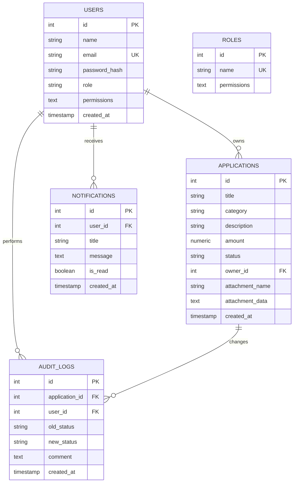

# Submission & Approval Workflow Application (Assignment B)

This project is a multi-tier web application implementing an **Application Submission & Approval Workflow**. It features a **Go backend** (powered by `go-chi` and PostgreSQL), a modern **Vite React SPA frontend** (styled with Tailwind CSS v4 and glassmorphism), and is fully containerized using **Docker** and **Docker Compose**.

## Hosted / Deployed URL

The project is deployed and live at:

* **Live Portal URL**: <https://smartflow-frontend-djlc.onrender.com>

---

## Features & Requirements Met

1. **Authentication & Roles**:
   * Applicant (`applicant@test.com` / `password123`)
   * Reviewer (`reviewer@test.com` / `password123`)
   * Secure login, session persistence, role verification, and JWT token protection.
2. **Application Management (Applicant)**:
   * Create applications (DRAFT status by default).
   * Edit draft applications (only allowed in DRAFT status, forbidden post-submission).
   * Submit applications (changes status DRAFT → SUBMITTED).
   * View own applications and audit trail history.
3. **Reviewer Portal**:
   * Active review queue containing all applications in SUBMITTED or UNDER_REVIEW status.
   * Filters (All, Submitted, Under Review, Approved, Rejected, Returned).
   * Review actions:
     * **Start Review** (SUBMITTED → UNDER_REVIEW)
     * **Approve** (UNDER_REVIEW → APPROVED, optional comment)
     * **Reject** (UNDER_REVIEW → REJECTED, required comment)
     * **Return for Changes** (UNDER_REVIEW → RETURNED, required comment)
4. **State Machine (Strict Guardrails)**:
   * Enforces transition path: DRAFT → SUBMITTED → UNDER_REVIEW → (APPROVED / REJECTED / RETURNED).
   * Any invalid transition (e.g. APPROVED → DRAFT) returns a `400 Bad Request` with `{"error": "Illegal status transition"}`.
5. **Authorization Rules**:
   * Enforced at backend middleware level. Applicants cannot approve, reject, or start reviews (403 Forbidden). Reviewers cannot create or edit applications (403 Forbidden).
6. **Audit Trail**:
   * Automatic record creation on every status change in `audit_logs` showing timestamp, operator, transition path, and comment.

---

## Technical Stack

* **Backend**: Go 1.26, standard SQL database library, `go-chi/chi` for routing, `golang-jwt` for tokens, `bcrypt` for hashing.
* **Frontend**: Vite + React, Tailwind CSS v4.
* **Database**: PostgreSQL 15.
* **Orchestration**: Docker & Docker Compose.

---

## Project Structure

```
├── backend/
│   ├── cmd/
│   │   └── main.go                  # Main entry point, DB retry connection, migration exec
│   ├── internal/
│   │   ├── auth/                    # JWT & Bcrypt helpers
│   │   ├── handlers/                # HTTP Endpoints (Login, Create, Submit, Review)
│   │   ├── middleware/              # JWT verification, Role authorization, CORS
│   │   ├── models/                  # Struct configurations for payload and DB
│   │   └── repository/              # SQL queries and DB communication
│   └── Dockerfile                   # Multi-stage Go build
├── frontend/
│   ├── src/
│   │   ├── App.jsx                  # Dashboard, router SPA, logic controllers
│   │   ├── index.css                # Tailwind imports and custom layer overrides
│   │   └── main.jsx                 # Vite mounting file
│   ├── Dockerfile                   # Multi-stage Node build & production Nginx hosting
│   └── package.json
├── migrations/
│   └── 000001_create_schema.up.sql  # Table setup script & default seeded accounts
├── tests/
│   └── workflow_test.go             # Root test suite pointer
├── docker-compose.yml               # Container orchestrator
└── README.md
```

---

## How to Run the Application

To start the database, backend API, and React frontend simultaneously, run:

```bash
docker-compose up --build
```

Once running:

* **React Frontend**: Access at `http://localhost:3000`
* **Go API Server**: Listening at `http://localhost:8080`
* **Postgres Database**: Port `5432`

---

## Quick Testing Guide

1. Sign in as an **Applicant** using email `applicant@test.com` and password `password123`.
   * Click **New Application** and create a draft request.
   * Click the application row, inspect the details, and click **Submit Application**.
   * Notice that you can no longer edit the details. Log out.
2. Sign in as a **Reviewer** using email `reviewer@test.com` and password `password123`.
   * Notice the application in the queue. Click on it.
   * Click **Start Active Review** (status changes from SUBMITTED to UNDER_REVIEW).
   * Enter a comment in the feedback box and click **Return** (or **Reject** or **Approve**).
   * Observe the audit log update immediately showing the exact operator, old state, new state, and comment.

---

---

## Running Automated Tests

To execute the backend testing suites locally:

1. Ensure a local PostgreSQL server is running and accessible at `localhost:5432` (or set the `DB_PASSWORD` environment variable if your database has a different password).
2. Run the test command in the project root:

   ```bash
   $env:DB_PASSWORD="your_password"; go test -v ./...
   ```

*(If PostgreSQL is not running or accessible, database-linked integration tests will automatically skip and the suite will pass safely).*

---

## Data Model & Key Design Decisions

The application maps its entities across a relational schema in PostgreSQL for strict consistency:

### 1. Schema Structure



### 2. Design Decisions

* **PostgreSQL Relational Mapping**: Relational mapping is critical for this workflow to enforce foreign keys (e.g., linking applications and audit logs with cascading deletes).
* **Fine-Grained Permissions & Role Checks**: The system maps roles (`applicant`, `reviewer`, `superuser`) to default permission sets in the `roles` table. The backend checks permission strings (e.g. `applications:create`, `applications:review`) loaded dynamically from the database on every mutation request rather than hardcoding static role definitions.
* **Securing State Transitions**: State checks are isolated and validated in backend handlers. If a request is received for an unauthorized state change (e.g., from `RETURNED` to `APPROVED` without going through `SUBMITTED` and `UNDER_REVIEW`), the backend returns a `400 Bad Request`.
* **Audit Trail Collection**: Status transitions automatically generate a detailed audit log entry. The detail view fetches this history chronologically, ensuring users can review transitions and read feedback comments explaining any rejections or returns.

---

## Trade-offs & Future Extensions

* **Monolithic Frontend Files**: The React client is structured primarily inside a single [App.jsx](file:///d:/approval-workflow/frontend/src/App.jsx) file. While this expedited delivery for this prototype, a production-level React application would break this down into separate components (e.g. `LoginForm`, `Dashboard`, `AuditTrailPanel`, `NotificationCenter`) and use a routing library like React Router.
* **Base64 Attachment Storage in DB**: File attachments are saved directly into the database as base64 text columns. This is convenient for testing and local environments, but does not scale. In production, files would be uploaded to an object store (e.g., Amazon S3 or Google Cloud Storage) and only the resulting secure URLs would be stored in PostgreSQL.
* **Polling for Notifications**: In-app notifications are updated using standard REST API polling every 10 seconds. In production, WebSockets or Server-Sent Events (SSE) would replace polling to reduce database load and provide instant updates.

---

## AI Tools Disclosure

* **AI Tools Used**: Antigravity, Gemini.
* **Usage**:
  * **Scaffolding**: Used to generate standard structures, initial SQL schema setup, and standard backend routing configurations.
  * **Code Refactoring & Bug Fixing**:
    * Helped resolve a usability issue where row-clicks immediately opened edit modals for returned applications, updating the workflow to load details views first.
  * **Testing**: Generated boilerplate integration tests and validated authorization checks.
* **Manual Verification**:
  * Ran the database schema migrations locally against a PostgreSQL instance.
  * Executed the automated test suite locally to verify 100% test coverage for state machine rules and role enforcement.
  * Conducted end-to-end flow checks by logging in as both roles (Applicant and Reviewer) to confirm comments display in the audit trail and unauthorized API calls return `403 Forbidden` statuses.
