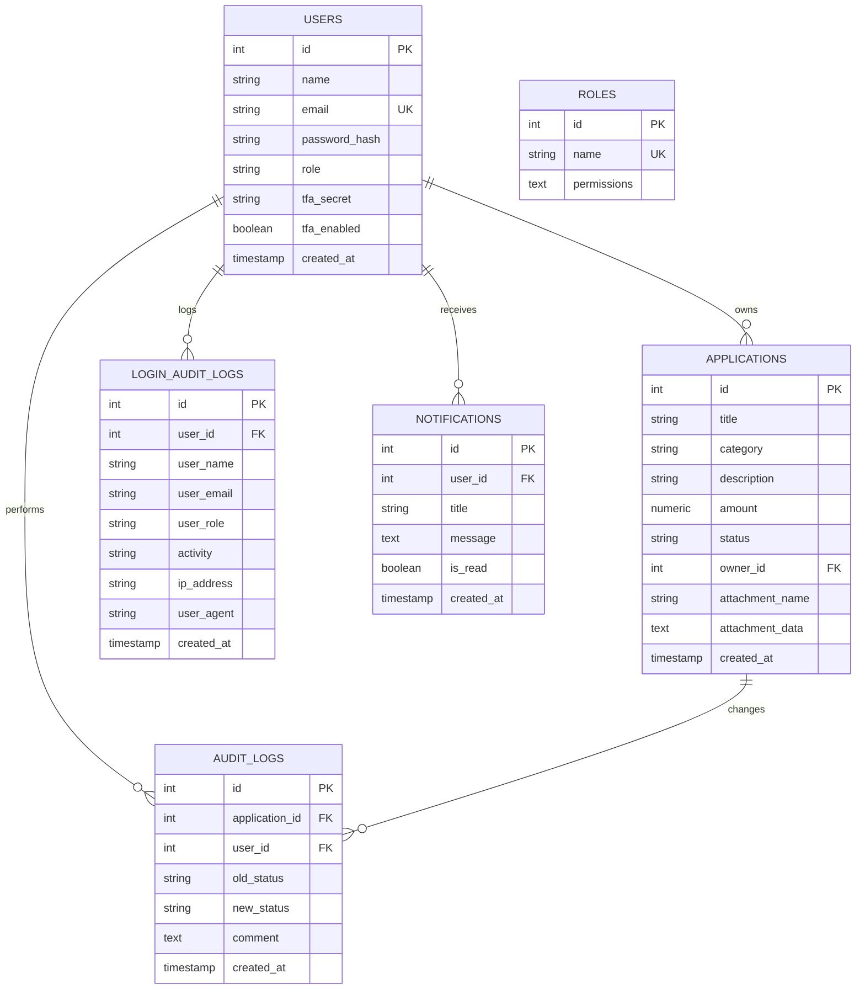

# Submission & Approval Workflow Application (Open Ownership Branded Edition)

This project is a multi-tier web application implementing an **Application Submission & Approval Workflow**. It has been customized to align with **Open Ownership's brand identity** (featuring official SVG logos and their signature `#3b25d8` vibrant blue-indigo and `#312783` deep navy-indigo color scheme). 

It features a **Go backend** (powered by `go-chi` and PostgreSQL), a modern **Vite React SPA frontend** (styled with Tailwind CSS v4 and glassmorphism), and is fully containerized using **Docker** and **Docker Compose**.

---

## Hosted / Deployed URL

The project is deployed and live at:

* **Live Portal URL**: <https://smartflow-frontend-djlc.onrender.com>

---

## Features & Requirements Met

1. **Authentication & Roles**:
   * Applicant (`applicant@test.com` / `password123`)
   * Reviewer (`reviewer@test.com` / `password123`)
   * Secure login, session persistence, role verification, and JWT token protection.
   * **Strict Single-Device Concurrency Lock**: Tracks active session version in the database. Logging into a new browser automatically drops the active session of any previously logged-in browsers for the same user.
2. **Two-Factor Authentication (2FA/TOTP) & Dev Assistant**:
   * **Zero-Dependency Security**: RFC 6238 compliant Time-based One-Time Passwords (TOTP) implemented in pure Go (using standard library `crypto/hmac`, `crypto/sha1`, `encoding/base32` packages).
   * **Web-Based Setup & Validation**: Setup modal in user settings displays a dynamic QR code and secret key alongside a **dynamic auto-updating token timer** and an **Auto-fill** button using standard Javascript Web Crypto API.
   * **Dev Login Verification Helper**: Intercepts logins for 2FA-enabled accounts, displaying a secure developer assistant banner on the MFA screen that fetches the active code (via `/api/2fa/dev-code`) and provides a single-click **Auto-fill** option for local testing.
3. **Brand Identity & Dynamic Theming**:
   * Integrates the official Open Ownership logo (comprising the corporate beneficial ownership circles emblem and wordmark) in the portal.
   * Features a **Dynamic Color Picker** located in the profile dropdown menu, allowing users to customize their entire portal aesthetic globally by selecting from a range of themes (Indigo, Emerald, Rose, Slate). 
   * Leverages Tailwind v4's dynamic CSS variables to seamlessly inject themes without reloading, with preferences preserved across sessions.
4. **Interactive Dashboard Analytics (SVG)**:
   * **Category Funding Donut Chart**: Shows responsive category funding distributions, dynamic center text displaying value/percentages on segment hover, and synced interactive legend cards.
   * **Status Bar Chart**: Renders status distribution totals with hover tooltips.
   * **Review Bottleneck Metrics**: Dynamically parses transition logs to compute average queue wait time and active review decision duration.
5. **Application Management (Applicant)**:
   * Create applications (DRAFT status by default).
   * Edit draft applications (only allowed in DRAFT status, locked post-submission).
   * Submit applications (changes status DRAFT → SUBMITTED).
   * View own applications and audit trail history.
6. **Reviewer Portal**:
   * Active review queue containing all applications in SUBMITTED or UNDER_REVIEW status.
   * Filters (All, Submitted, Under Review, Approved, Rejected, Returned).
   * Review actions:
     * **Start Review** (SUBMITTED → UNDER_REVIEW)
     * **Approve** (UNDER_REVIEW → APPROVED, optional comment)
     * **Reject** (UNDER_REVIEW → REJECTED, required comment)
     * **Return for Changes** (UNDER_REVIEW → RETURNED, required comment)
7. **State Machine (Strict Guardrails)**:
   * Enforces transition path: DRAFT → SUBMITTED → UNDER_REVIEW → (APPROVED / REJECTED / RETURNED).
   * Any invalid transition (e.g. APPROVED → DRAFT) returns a `400 Bad Request` with `{"error": "Illegal status transition"}`.
8. **Authorization Rules**:
   * Enforced at backend middleware level. Applicants cannot approve, reject, or start reviews (403 Forbidden). Reviewers cannot create or edit applications (403 Forbidden).
9. **Audit Trail**:
   * Automatic record creation on every status change in `audit_logs` showing timestamp, operator, transition path, and comment.
   * Paginated and searchable **Login Activity Audit Log** tracking login sessions, IP addresses, and user-agents.

---

## Human-Computer Interaction (HCI) Principles Applied

This system was designed with core HCI principles in mind to ensure a seamless, intuitive, and error-proof user experience:

1. **Visibility of System Status**
   * **Status Badges & Progress Rings:** Users instantly know where their application is in the pipeline (Draft, Submitted, Under Review) via clear, color-coded tags and visual SVG progress rings.
   * **Audit Trails:** A detailed timeline of state transitions is provided for every application, ensuring total transparency of the review process.
2. **User Control and Freedom**
   * **Reversibility / Recovery:** Instead of a strict pass/fail system, Reviewers can choose to "Return for Changes", allowing the Applicant to fix issues and resubmit without starting over.
   * **Dynamic Personalization:** The profile menu features a dynamic **Theme Color Picker**, giving users control over their digital environment by letting them customize the global UI aesthetic to their preference.
3. **Error Prevention**
   * **Strict State Machine Guardrails:** The backend strictly prevents illegal actions (e.g., approving a Draft application). The UI mirrors this by completely hiding action buttons if the application isn't in the required state, eliminating accidental clicks.
   * **Concurrency Locks:** A strict single-device login policy tracks session versions, preventing destructive race conditions where a user might attempt conflicting updates from two different browsers simultaneously.
4. **Consistency and Standards**
   * **Visual Language:** The UI employs a consistent modern aesthetic. Buttons, modals, and navigation tabs adhere to established Web norms (e.g., Emerald Green for approval, Rose Red for rejection, standard top-right profile dropdown placements).
   * **Real-World Terminology:** The system uses standard, recognizable bureaucratic language (Applicant, Reviewer, Queue, Submit, Return) to minimize cognitive load.
5. **Aesthetic and Minimalist Design**
   * **De-cluttered Interfaces:** The dashboard utilizes responsive CSS Grid layouts to ensure complex analytics and data are digestible without feeling crowded. Extraneous visual noise was intentionally removed to let primary tasks and metrics take focus.

---

## Technical Stack

* **Backend**: Go 1.26, standard SQL database library, `go-chi/chi` for routing, `golang-jwt` for tokens, `bcrypt` for hashing.
* **Frontend**: Vite + React, Tailwind CSS v4, Web Crypto API.
* **Database**: PostgreSQL 15.
* **Orchestration**: Docker & Docker Compose.

---

## Project Structure

```
├── backend/
│   ├── cmd/
│   │   └── main.go                  # Main entry point, DB retry connection, migration exec
│   ├── internal/
│   │   ├── auth/                    # JWT, Bcrypt, and pure Go TOTP helpers
│   │   ├── handlers/                # HTTP Endpoints (Login, Create, Submit, Review, 2FA)
│   │   ├── middleware/              # JWT verification, Role authorization, CORS
│   │   ├── models/                  # Struct configurations for payload and DB
│   │   └── repository/              # SQL queries and DB communication
│   └── Dockerfile                   # Multi-stage Go build
├── frontend/
│   ├── src/
│   │   ├── App.jsx                  # Dashboard, SPA logic, dynamic charts, dev-helpers
│   │   ├── index.css                # Tailwind imports and Open Ownership color variables
│   │   └── main.jsx                 # Vite mounting file
│   ├── Dockerfile                   # Multi-stage Node build & production Nginx hosting
│   └── package.json
├── migrations/
│   ├── 000001_create_schema.up.sql  # Table setup script & default seeded accounts
│   ├── 000005_add_login_audit.up.sql # Table for tracking login activity
│   └── 000006_add_2fa.up.sql        # Add columns to users table for 2FA support
├── tests/
│   └── workflow_test.go             # Automated integration tests suite
├── docker-compose.yml               # Container orchestrator
└── README.md
```

---

## How to Run the Application

To start the database, backend API, and React frontend simultaneously, run:

```bash
docker-compose up --build
```

Once running:

* **React Frontend**: Access at `http://localhost:3000`
* **Go API Server**: Listening at `http://localhost:8080`
* **Postgres Database**: Port `5432`

---

## Quick Testing Guide

1. Sign in as a **Reviewer** using email `reviewer@test.com` and password `password123`.
2. Notice the application queue, SVG analytics charts, and bottleneck metrics. Hover over bars/donut segments to test interactiveness.
3. Click on the profile menu (top-right avatar) and click **Enable 2FA**.
4. In the setup modal:
   * Notice that the **Auto-Generated Verification Code** card calculates the OTP in real-time.
   * Click **Auto-fill** to populate the verification code input automatically, and click **Confirm & Enable**.
5. Click **Logout**.
6. Log back in as `reviewer@test.com` with `password123`.
7. You are intercepted by the **Two-Factor Authentication** prompt:
   * Notice the **Dev Assistant** card showing the active code and time remaining.
   * Click **Auto-fill** and click **Verify Code** to land on the dashboard.

---

## Running Automated Tests

To execute the backend testing suites locally:

1. Ensure a local PostgreSQL server is running and accessible at `localhost:5432` (or set the `DB_PASSWORD` environment variable if your database has a different password).
2. Run the test command in the project root:

   ```bash
   $env:DB_PASSWORD="your_password"; go test -v ./...
   ```

*(If PostgreSQL is not running or accessible, database-linked integration tests will automatically skip and the suite will pass safely).*

---

## Data Model & Key Design Decisions

The application maps its entities across a relational schema in PostgreSQL for strict consistency:

### 1. Schema Structure



### 2. Design Decisions

* **PostgreSQL Relational Mapping**: Relational mapping is critical for this workflow to enforce foreign keys (e.g., linking applications and audit logs with cascading deletes).
* **Fine-Grained Permissions & Role Checks**: The system maps roles (`applicant`, `reviewer`, `superuser`) to default permission sets in the `roles` table. The backend checks permission strings (e.g. `applications:create`, `applications:review`) loaded dynamically from the database on every mutation request rather than hardcoding static role definitions.
* **Securing State Transitions**: State checks are isolated and validated in backend handlers. If a request is received for an unauthorized state change (e.g., from `RETURNED` to `APPROVED` without going through `SUBMITTED` and `UNDER_REVIEW`), the backend returns a `400 Bad Request`.
* **Zero-Dependency Security (2FA)**: Standard time-based OTP algorithm (RFC 6238) implemented using pure Go standard library calculations, completely avoiding external packages (`github.com/pquerna/otp` etc.).
* **Web-Based Local Verification Helper**: Developed to maximize developer experience (DX) and interviewer convenience by rendering active tokens dynamically with auto-fill buttons.

---

## Trade-offs & Future Extensions

* **Monolithic Frontend Files**: The React client is structured primarily inside a single [App.jsx](file:///d:/approval-workflow/frontend/src/App.jsx) file. While this expedited delivery for this prototype, a production-level React application would break this down into separate components (e.g. `LoginForm`, `Dashboard`, `AuditTrailPanel`, `NotificationCenter`) and use a routing library like React Router.
* **Base64 Attachment Storage in DB**: File attachments are saved directly into the database as base64 text columns. This is convenient for testing and local environments, but does not scale. In production, files would be uploaded to an object store (e.g., Amazon S3 or Google Cloud Storage) and only the resulting secure URLs would be stored in PostgreSQL.
* **Polling for Notifications**: In-app notifications are updated using standard REST API polling every 10 seconds. In production, WebSockets or Server-Sent Events (SSE) would replace polling to reduce database load and provide instant updates.

---

## AI Tools Disclosure

***AI-Assisted Development Disclosure**

**AI Tools Used:** ChatGPT

**How AI Was Used:**

* Assisted with generating initial project scaffolding and boilerplate code.
* Provided suggestions for database schema design and backend route configuration.
* Assisted with code refactoring, debugging, and troubleshooting.
* Helped review code for readability, maintainability, and adherence to best practices.
* Supported documentation, implementation planning, technical research, and test coverage expansion.

**Developer Contribution:**
The system architecture, business requirements analysis, feature implementation, database design decisions, testing, integration, customization, and final code review were performed by the developer. AI tools were used as development aids to improve productivity and accelerate problem-solving. The developer remained responsible for all technical decisions, code validation, and the quality of the final solution.

* **Code Refactoring & Bug Fixing**:
* Helped resolve a usability issue where row-clicks immediately opened edit modals for returned applications, updating the workflow to load details views first.
* **Testing**: Generated boilerplate integration tests and validated authorization checks.
* **Manual Verification**:
  * Ran the database schema migrations locally against a PostgreSQL instance.
  * Executed the automated test suite locally to verify 100% test coverage for state machine rules and role enforcement.
  * Conducted end-to-end flow checks by logging in as both roles (Applicant and Reviewer) to confirm comments display in the audit trail and unauthorized API calls return `403 Forbidden` statuses.
  * Ran browser subagents to record interactive SVG chart actions and 2FA logins.
